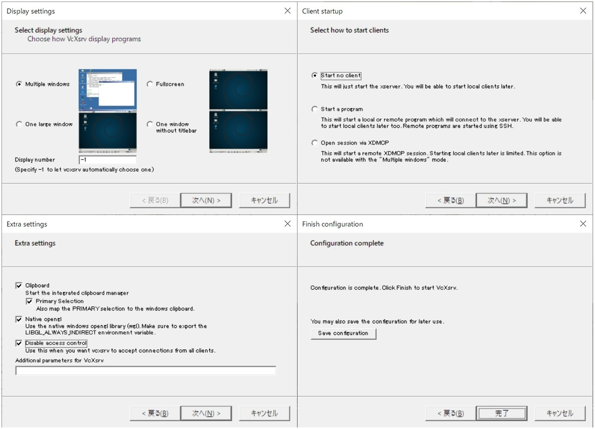
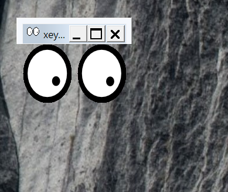
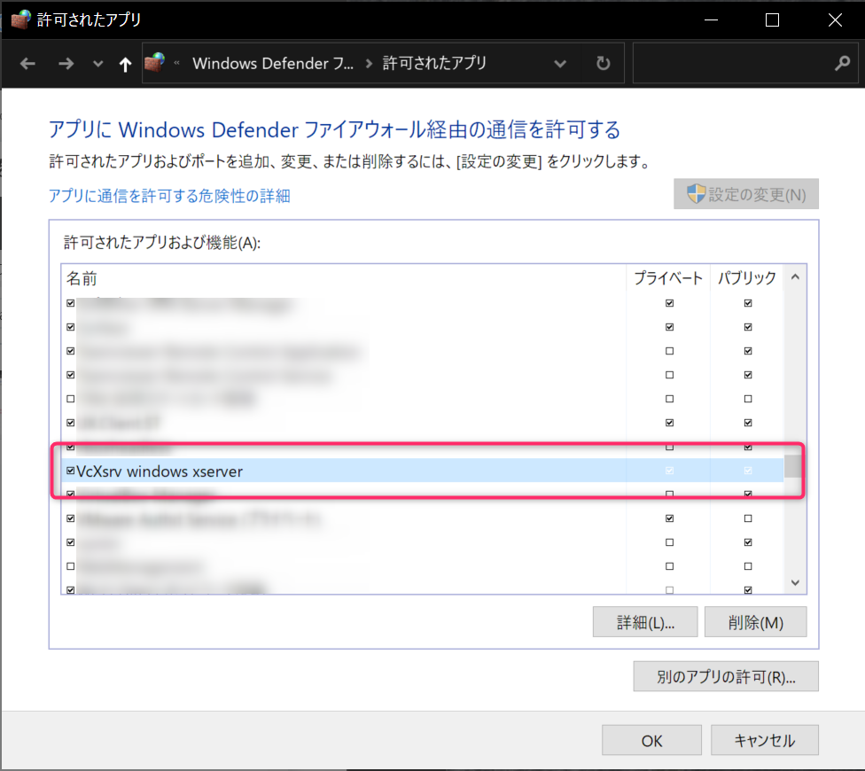
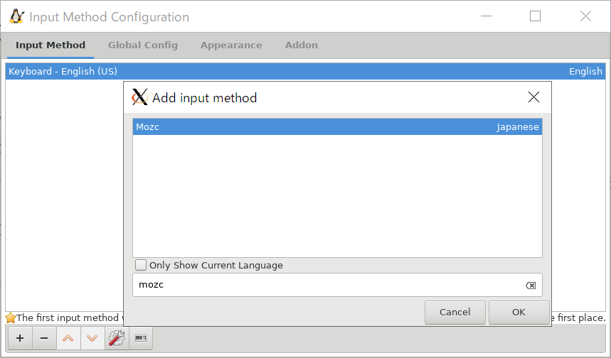
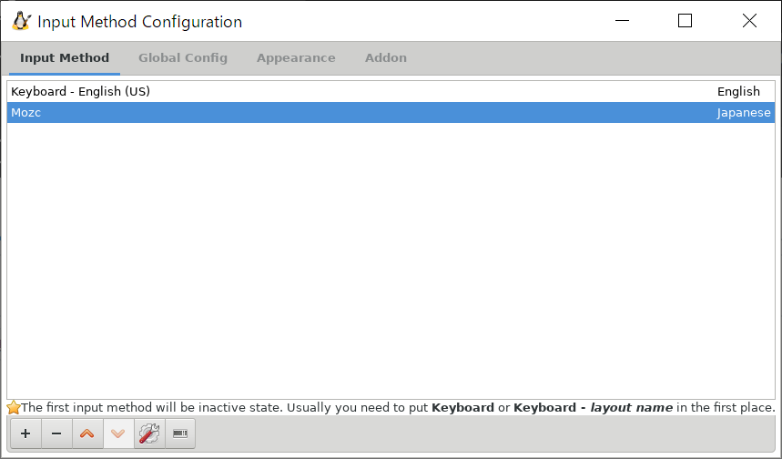
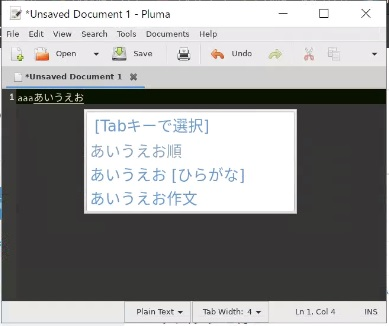

## はじめに

WindowsでPHPなどの開発をしていると色々トラブルに見舞われます。  

WSL2やWindows terminalの登場で、端末環境はほぼLinux同等のものが動くようになりました。

しかし、コード編集にWindows側のIDEを使おうとすると色々トラブルに見舞われます。  
（Dockerの実効速度とか、Git管理時のパーミッション問題とか）

それらはLinuxマシンを使えば解決することですが、Windowsマシンを使いたい。。。  

今回はWSL2に開発ツールを詰め込みX-Server経由でGUI操作することで、Windowsの依存性を限りなく減らした環境を作成します。

## 補足

VSCodeを使用する場合はX環境を設定しなくても、Remote Develop機能でWSL2内の環境を直接操作できると思います。  

また、Windowsのファイルエクスプローラで```\\wls$\ubuntu-18.04\```にアクセスすると、WSL2内のファイルが参照できますので、Windows側から操作できます。

今回は、X-Server経由でWSL2内のPhpStorm（Intellij IDEA）を利用して開発する環境を設定しました。

## ゴール
下記の設定を行います。

- WSL2の有効化
- Docker、Docker Composeをインストール
- X-Server設定し、WSL2上のPhpStormを開く


## 環境

- ホスト
    - Windows10 Professional
        - バージョン2004（OSビルド 19041.1）
- WSL2
   - Ubuntu 18.04

## 設定手順

1. [WSL2の有効化](#１wsl2の有効化)
1. [X-Serverの設定](#２x-serverの設定)
1. [Dockerのインストール](#３dockerのインストール)
1. [PhpStorm設定](#４phpstormの設定)
1. [その他ツール（Node.js、Fish）](#５その他ツールのインストール)

<div id="setting1"></div>

### １．WSL2の有効化

WSLにUbuntuをインストールして、WSL2を有効化します。

#### ① Windows InsiderPreviewのFastリングを導入

参考： https://insider.windows.com/ja-jp/how-to-pc/

#### ② 仮想マシンを有効化


```bash
> Enable-WindowsOptionalFeature -Online -FeatureName VirtualMachinePlatform
```

#### ③ WSLのバージョンを2に変更

```bash
> wsl --set-version Ubuntu-18.04 2
```

#### ④ バージョン2になったことを確認

```bash
> wsl -l -v
  NAME            STATE           VERSION
* Ubuntu-18.04    Running         2
```

#### 余談
端末は[Windows Terminal](https://www.microsoft.com/ja-jp/p/windows-terminal-preview/9n0dx20hk701)を使っています。

### ２．X-Serverの設定

下記ページを参考にX-Serverを設定しました。

参考ページ：

- [WSLでIntelliJを動かして、Windowsでも最高の開発環境を手に入れる](https://bbq-all-stars.github.io/2019/04/30/wsl-ubuntu-intellij-develop-environment.html)
- [WSL で Ubuntu デスクトップ環境を作ってみる](https://tmtms.hatenablog.com/entry/201812/wsl-ubuntu)
- [WSL2 Ubuntu 18.04 に GNOME + Fcitx-Mozc を導入して日本語デスクトップ環境を構築する最終解](https://kazblog.hateblo.jp/entry/2018/05/28)
- [Ubuntu18.04+WSLでfcitx-mozcを使って日本語入力出来るようにする](https://kazblog.hateblo.jp/entry/2018/05/28/221242)

#### ① X環境のインストール

少しでも軽いものをと思い、軽量デスクトップ環境のXfceを選択しました。

```bash
$ sudo apt update && sudo apt upgrade -y
$ sudo apt install -y xfce4-terminal xfce4-session xfce4
```

※途中、ログインマネージャの選択（GDMとLightDM）が出ますが、おそらくどちらでも構いません。  
私はLightDMを選びました。

#### ② WindowsにVcXsrv（XServer）をインストール

下記リンクよりダウンロードしてインストールします。

https://sourceforge.net/projects/vcxsrv/

XLaunch（VcXsrvのアプリ名）を起動します。

設定はこちら

- 1ページ目：Multiple Windows
- 2ページ目：Start no client
- 3ページ目：全部チェック



一度起動したらそのまま放置しておけば良いですが、  
毎回設定するのは面倒なので、ショートカットや自動起動の設定をしておくと良いです。

#### ③ X環境の動作確認

WSL2側で".bashrc"に下記を追記します。

```bash
export DISPLAY=$(cat /etc/resolv.conf | grep nameserver | awk '{print $2}'):0.0
```

設定をリロード

```bash
$ source $HOME/.bashrc
```

試しにxeyesを表示させてみます。

```bash
$ xeyes
```

起動に成功すると、xeyesのアプリが表示されます。



もし、起動されなかった場合はWindows側でVcXsrvのファイアウォール設定を試してください。



設定の詳細については下記を参照してください。

[WSL2のX-ServerでGUI表示する際に「export DISPLAY=:0.0」が効かない](/blog/2020/01/wsl2-xserver-export-display/)

#### ④ 日本語環境のインストール

日本語環境として、fcitx-mozcをインストールします。  
※色々試し、上手く行った方法をまとめます

１．Japanese Teamの追加パッケージを設定

```bash
$ wget -q https://www.ubuntulinux.jp/ubuntu-ja-archive-keyring.gpg -O- | sudo apt-key add -
$ wget -q https://www.ubuntulinux.jp/ubuntu-jp-ppa-keyring.gpg -O- | sudo apt-key add -
$ sudo wget https://www.ubuntulinux.jp/sources.list.d/bionic.list -O /etc/apt/sources.list.d/ubuntu-ja.list
$ sudo apt update
$ sudo apt upgrade
$ sudo apt install ubuntu-defaults-ja
```

２．fcitx-mozcのインストール

```bash
$ sudo apt install fcitx fcitx-mozc
```

環境変数が必要なため、以下を```.bashrc```に追記します。

```bash
export GTK_IM_MODULE=fcitx
export QT_IM_MODULE=fcitx
export XMODIFIERS=@im=fcitx
export DefaultIMModule=fcitx
```

設定をリロード

```bash
$ source $HOME/.bashrc
```

３．日本語フォントをインストール

```bash
$ sudo apt install fonts-noto-cjk fonts-noto-color-emoji
```

４．日本語ロケールに設定

```bash
$ sudo update-locale LANG=ja_JP.UTF8
```

５．日本語変換を利用する設定
fcitxを起動する

```bash
$ fcitx-autostart
```

※fcitx-autostartは自動起動させたいですが、.bashrcなどに書くとX環境を使っていないときに端末が立ち上がらなくなります。  
なので、Windows側でVcXsrvを立ち上げた後にコマンドを実行してやります。

６．入力メソッドの追加

下記コマンドを実行して、入力メソッドの設定を開きます。

```bash
$ fcitx-config-gtk3
```

左下の「＋」ボタンから、Mozcを追加してください。



設定するとこうなります。



試しにエディタを開いて、Ctrl+Spaceキーで日本語が入力できればOKです。  
（確認用エディタはplumaを使用してます。）



<div id="setting3"></div>

### ３．Dockerのインストール

下記手順に従ってDocker, Docker Composeをインストールします。

#### ① Dockerのインストール
公式サイトを参考にインストールします。

```bash
$ sudo apt install \
    apt-transport-https \
    ca-certificates \
    curl \
    gnupg-agent \
    software-properties-common
$ curl -fsSL https://download.docker.com/linux/ubuntu/gpg | sudo apt-key add -
$ sudo add-apt-repository \
   "deb [arch=amd64] https://download.docker.com/linux/ubuntu \
   $(lsb_release -cs) \
   stable"

$ sudo apt update
$ sudo apt install docker-ce docker-ce-cli containerd.io
```

インストールの確認

```bash
$ docker -v
Docker version 19.03.5, build 633a0ea838
```

このままではroot権限が無いと実行できないため、一般ユーザでも実行できるよう設定します。
(groupはすでに作られていると思いますが、一応実行)

```bash
$ sudo groupadd docker
$ sudo usermod -a -G docker <user_id>
```

WSL2を再起動することで反映されます。  
PowerShellで下記コマンドを実行します。

```bash
wslconfig /t Ubuntu-18.04
```

参考： https://docs.docker.com/install/linux/docker-ce/ubuntu/

#### ② Docker Composeのインストール
同様にDocker Composeもインストールします。

```bash
$ sudo curl -L "https://github.com/docker/compose/releases/download/1.25.0/docker-compose-$(uname -s)-$(uname -m)" -o /usr/local/bin/docker-compose
$ sudo chmod +x /usr/local/bin/docker-compose
$ 
```

インストールの確認

```bash
$ docker-compose -v
docker-compose version 1.25.0, build 0a186604
```

参考： https://docs.docker.com/compose/install/

#### 補足：dockerデーモンの起動について

WSL2の現バージョンでは、systemdが正しく動かず、デーモンの自動起動が設定できないようです。

WSL2を再起動するたびにdockerデーモンを起動する必要があります。  
（インストール直後も起動していないため、下記コマンド実行が必要です）

起動コマンドは下記です。

```bash
$ sudo service docker start
```

<div id="setting4"></div>

### ４．PhpStormの設定

PhpStormのインストールについて説明します。

#### ① インストール方法

今回はToolboxからインストールしました。

１．下記サイトより、Toolbox AppのLinux版（tar.gz）をダウンロード

https://www.jetbrains.com/ja-jp/toolbox-app/

２．下記コマンドを実行してインストール

```bash
$ sudo tar -xzf jetbrains-toolbox-*.tar.gz -C /usr/local/bin --strip-components 1
```

３．Toolbox起動

```bash
$ jetbrains-toolbox
```

VcXsrvを立ち上げているとGUIが起動します。  
その後、アプリよりインストールしてください。

#### ② PhpStormの設定
開発言語に合わせて設定してください。

Git、Docker、Node.jsなどはインストール後に設定を開くと自動で認識して設定されます。

また、フォントとして「Ricty Diminished」もインストールしました。

```bash
$ sudo apt install fonts-ricty-diminished
```

<div id="setting5"></div>

### ５．その他ツールのインストール

#### Node.js

IDEからLinterツールなどを実行するにはローカルにNode.jsをインストールしていたほうが都合がよいため、インストールします。

nvmからインストールしました。

```bash
$ curl -o- https://raw.githubusercontent.com/nvm-sh/nvm/v0.35.0/install.sh | bash
$ source $HOME/.bashrc
```

Node.js（LTS）のインストール

```bash
$ nvm install --lts
```

ついでにyarnもインストール  
※指定したnodeのバージョン配下を指定してインストールする

```bash
$ node -v
v12.14.1
$ nvm use 12.14.1
$ npm install -g yarn
```

```bash
$ node -v
v12.14.1
$ npm -v
6.13.4
$ yarn -v
1.21.1
```

#### Fish Shell
シェルにfishをインストールします。  
コマンドやディレクトリ名の補完機能が便利です。

テーマはシンプルな「clearance」に設定しました。

また、aliasなどの設定はbashで設定しているため、```.bashrc```の末尾に"exec fish"を記載してbash経由で起動しています。

① fishのインストール

インストールは公式の情報を[参考](https://github.com/fish-shell/fish-shell)にしました。

```bash
$ sudo apt-add-repository ppa:fish-shell/release-3
$ sudo apt-get update
$ sudo apt-get install fish
```

② テーマの変更

テーマやプラグイン管理のツール「fisherman」をインストールします。（[参考](https://github.com/jorgebucaran/fisher)）  
テーマはシンプルな「clearance」を選択しました。

```bash
$ curl https://git.io/fisher --create-dirs -sLo ~/.config/fish/functions/fisher.fish
```

以下はfish内で実行。

```bash
$ fish
> fisher add oh-my-fish/theme-clearance
```

③ 各種プラグインのインストール

- bassのインストール  
fishでbashコマンドを使えるようにするためのプラグインです。

```bash
> fisher add edc/bass
```

bashのスクリプトも下記のように動かすことができます。

```bash
> bass test.sh
> bass source config.sh
```

- pecoのインストール

pecoは入力された一覧から絞り込み検索と、選択ができるようになるツールです。([参考](https://qiita.com/xtetsuji/items/05f6f4c1b17854cdd75b))

いろいろな用途があるようですが、今回はhistoryの検索を設定しています。

```bash
> sudo apt install peco
> fisher add oh-my-fish/plugin-peco
```

config.fishに設定を追記する

```bash
> cat ~/.config/fish/config.fish
function fish_user_key_bindings
  bind \cr 'peco_select_history (commandline -b)'
end
```

設定の反映

```bash
> source ~/.config/fish/config.fish
```

## 使用感について

たまにX環境が落ちることがありますが、おおむね快適に動作します。  
また、Docker for windowsで作業していたときよりもビルド速度が上がっているようなので（体感）、精神的にも安心です。

日本語環境がLinux側にあるためWindows側で登録した辞書が使えなかったり、変換ダイアログがカーソル位置ではなくウィンドウの左下に出ていたりと変換周りの惜しい点はあります。

また、次の２つのコマンドをWSL2起動のたびに実行する必要があるのが難点です。

```bash
$ sudo service docker start
$ fcitx-autostart
```

とはいえ、Windowsの環境に左右されないというのは大きなメリットといえます。

しばらく使ってまた追記します。

## 終わりに

WSL2を使った開発環境について記載しました。

本物のLinux環境には快適さは及びませんが、Windowsマシンを使う人にとっては環境構築の１選択肢となるのではないでしょうか。
