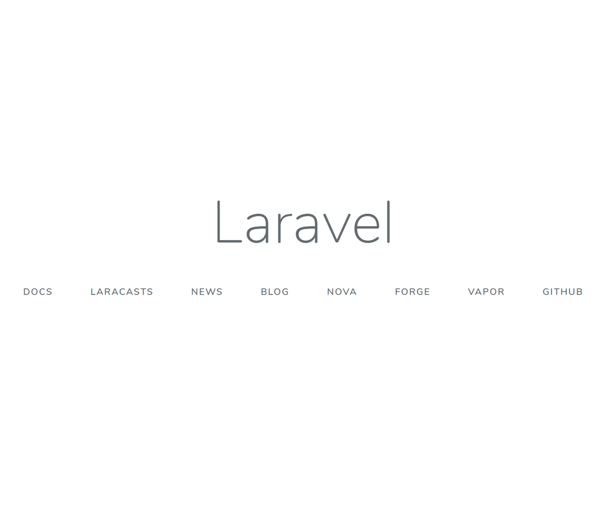
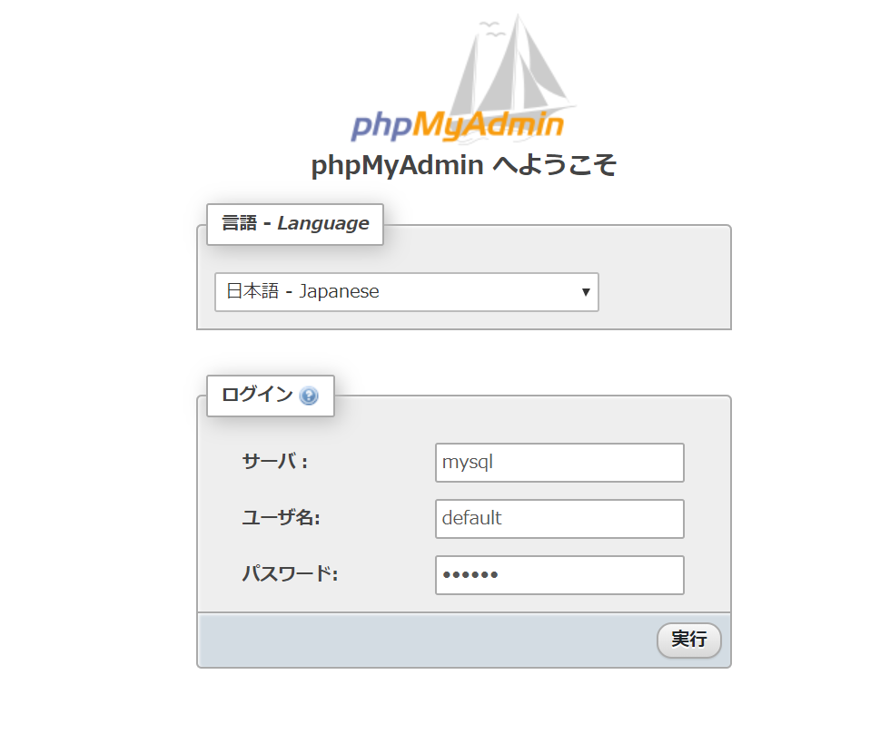

## はじめに

WSL2内にインストールしたDocker＋Laradockを利用して、Laravelの開発環境を作成する手順をメモします。

WSL2やDockerの設定はこちらの記事を参照してください。

[PhpStorm on WSL2でWindowsに依存しない開発環境を作る](/blog/2020/01/docker-on-wsl2-development-environment/)


## ゴール

- Laradockの設定と起動
- laravelのインストール

## ディレクトリ構成

こちらの構造で設定します。

Laradockも含めて１プロジェクト１リポジトリで管理したいことと、  
dockerコンテナ内にlaradockを持ち込みたくないのでこの構成にしています。

```
┬ <project_dir>
├ app  // laravel ディレクトリ
│  ├ app
│  ├ bootstrap
│  └ ...
└ laradock
```

- ディレクトリ構成の考え方はこちらをご参照ください。  

https://qiita.com/wajima/items/69fad6c2b42c52928e82

## 想定環境

今回は、下記のように設定しました。

- Nginx：latest
- PHP：7.3
- MySQL：latest
- phpMyAdmin：latest

各ミドルウェアのバージョンはデフォルト設定のまま使っています。  
latestで指定するとビルド時点の最新版が入るため、チームで環境をそろえたい場合などは.envファイルにバージョンを明記します。

## 設定方法

### １．Laradockの設定

下記はWSL2で行います。

#### ① プロジェクトディレクトリの作成

プロジェクトディレクトリと、appディレクトリを作成します。

```bash
$ mkdir <project_dir>
$ cd <project_dir>
```

ここで、appディレクトリを作成しておきます。

```bash
$ mkdir app
```

#### ② laradockをダウンロード

```bash
$ git clone  https://github.com/Laradock/laradock.git
```

#### ③ 設定ファイルのコピー

```bash
$ cd laradock
$ cp env-example .env
```

#### ④ 設定ファイル（.env）の編集

.envにはディレクトリの場所や、インストールされるミドルウェア（nginxやmysqlなど）のバージョンなど、いろいろな設定を記載することができます。  
この.envファイルの編集だけで、様々な環境に対応できるのがLaradockの強みだと思っております。

```bash
$ vi .env
```

##### １．laravelディレクトリを設定

好みの問題ですが、今回の構成に合わせて修正します。

```bash
- APP_CODE_PATH_HOST=../
+ APP_CODE_PATH_HOST=../app/
```

##### ２．データの保存ディレクトリを変更

デフォルトでは、ホームディレクトリに保存されてしまいます。  
このままでは、ほかのプロジェクトデータで上書きされるかもしれませんので、プロジェクト内に作成するよう変更します。

```bash
- DATA_PATH_HOST=~/.laradock/data
+ DATA_PATH_HOST=.laradock/data
```

##### ３．プロジェクト名の設定

laradockを使ったプロジェクトを複数作る場合、プロジェクト名が同じ場合、過去に作った同じ名前のコンテナイメージが上書きされてしまいます。  
後々面倒なことになるため、必ず被らない名前を設定してください。

```bash
- COMPOSE_PROJECT_NAME=laradock
+ COMPOSE_PROJECT_NAME=<project_name>
```

##### ４．ユーザID、グループIDを設定

WSL側とDocker側でユーザIDが異なると、Linuxではファイルの編集ができなくなります。

そのため、ユーザIDをWSL側と合わせてやります。  
Ubuntuの場合はデフォルトでよいと思います。

```bash
WORKSPACE_PUID=1000
WORKSPACE_PGID=1000
PHP_WORKER_PUID=1000
PHP_WORKER_PGID=1000
```

なお、PUIDとPGIDは```id```コマンドで確認できます。

```bash
$ id 
uid=1000(***) gid=1000(***) ....
```

##### ５．ポート設定

複数プロジェクトのDockerを起動する場合、ポートが被ることがあります。  
環境に合わせて変更してください。

複数プロジェクトを同時に立ち上げなければ基本デフォルトで問題ありません。

```bash
NGINX_HOST_HTTP_PORT=80
NGINX_HOST_HTTPS_PORT=443
MARIADB_PORT=3306
PMA_PORT=8080
```

#### ⑤ その他の設定

<b>１．MySQL設定</b>

MySQLは8系になってパスワードの生成方法が変わりそのままではLaravelから操作できません。

```<project_dir>/lardock/mysqmy.cnf```に下記を追加します。

```bash
// [mysqld]のエリアに追記する（デフォルトの場合一番下）
default_authentication_plugin=mysql_native_password
```

### ２．laradockの起動

下記コマンドでlaradockを起動します。
引数には起動したいミドルウェアを指定します。

なお、```<project_dir>/app```ディレクトリが存在しない場合はroot権限で作成されてしまうため、必ず作成した状態で起動してください。

```bash
$ docker-compose up -d nginx mysql workspace phpmyadmin
```

起動確認

```bash
$ docker-compose ps
              Name                            Command               State                    Ports
--------------------------------------------------------------------------------------------------------------------        laradock_test_docker-in-docker_1   dockerd-entrypoint.sh            Up      2375/tcp, 2376/tcp
laradock_test_mysql_1              docker-entrypoint.sh mysqld      Up      0.0.0.0:3306->3306/tcp, 33060/tcp
laradock_test_nginx_1              /bin/bash /opt/startup.sh        Up      0.0.0.0:443->443/tcp, 0.0.0.0:80->80/tcp        laradock_test_php-fpm_1            docker-php-entrypoint php-fpm    Up      9000/tcp
laradock_test_phpmyadmin_1         /docker-entrypoint.sh apac ...   Up      0.0.0.0:8080->80/tcp
laradock_test_workspace_1          /sbin/my_init                    Up      0.0.0.0:2222->22/tcp
```

### ３．Laravelのインストールと初期設定

ここでは、dockerコンテナ内からlaravelをインストールする方法と、  
簡単な設定を行います。

#### ① インストール

下記コマンドでWorkspaceコンテナに入ります。  
この時、```user```オプションでユーザを指定してください。

```bash
$ docker-compose exec --user=laradock workspace /bin/bash
```

コンテナ内で下記を実行します。  
（/var/www$ といった記述がある行はコンテナ内で実行していると思ってください）

```bash
/var/www$ composer create-project --prefer-dist laravel/laravel .
```

インストール完了したところで動作確認をします。

Windows側のブラウザで、```http://localhost```にアクセスします。

下記画面が表示されればインストール完了です。



#### ② 設定ファイルの編集

##### １．.envの設定

laravelの.envファイルの設定を変更します。

DBの設定を、laradockに合わせて変更する。  
※DB_HOSTはdocker-compose.ymlに書かれているコンテナ内名を指定します。

```bash
DB_CONNECTION=mysql
DB_HOST=mysql
DB_PORT=3306
DB_DATABASE=default
DB_USERNAME=default
DB_PASSWORD=secret
```

また、phpMyAdminは、「http://localhost:8080」にアクセスし下記値を入力してアクセスできます。

- サーバ：mysql
- ユーザ名：default
- パスワード：secret



##### ２．マイグレーションの確認

MySQLの設定が完了したか、マイグレーションで確認してみましょう。

下記のようになり、DBにテーブルが作成されればOKです。

```bash
/var/www$ php artisan migrate
Migration table created successfully.
Migrating: 2014_10_12_000000_create_users_table
Migrated:  2014_10_12_000000_create_users_table (0.36 seconds)
Migrating: 2014_10_12_100000_create_password_resets_table
Migrated:  2014_10_12_100000_create_password_resets_table (0.35 seconds)
Migrating: 2019_08_19_000000_create_failed_jobs_table
Migrated:  2019_08_19_000000_create_failed_jobs_table (0.1 seconds)
```

##### その他

他にも言語やタイムゾーンの設定、ディレクトリ構成を変えるなどいろいろなカスタマイズがあるかと思いますが、ここでは割愛します。

#### ③ Laravel-mixの動作確認

Vue.jsの設定とビルド、ホットリロードの確認を行います。

##### Vue.jsを利用する設定

Laravel 6.0からデフォルトではインストールされないため、laravel/uiからインストールします。

```bash
/var/www$ composer require laravel/ui --dev
/var/www$ php artisan ui vue
```

##### node_modulesのインストール

```bash
/var/www$ yarn
```

その後、```yarn dev```や```yarn watch```でビルドできます。


## 終わりに

WSL2を利用したLaravelの開発環境についてまとめました。

laradockはdocker-compose.ymlやDockerfileの書き方の参考になりますので、見るだけでも勉強になります。
