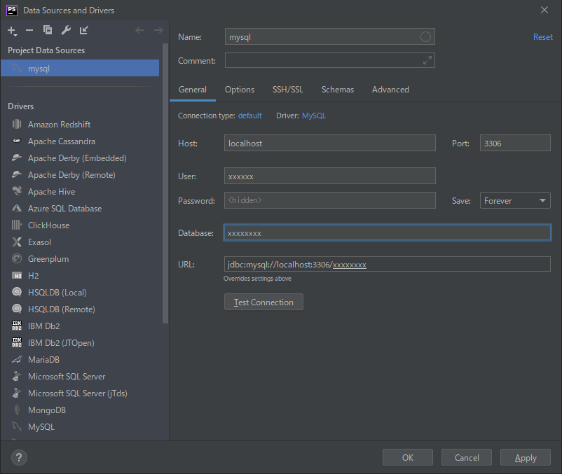

sshやsftpなどのコマンドで他のサーバーに接続できますが、接続のたびにIPアドレスやドメイン名を打つのは大変です。

また、サーバーの設定で、パラメータ追加や踏み台経由で接続する必要があるとさらにコマンドが長くなります。

こんな時は「~/.ssh/config」を設定すると快適に実行できます。

## 概要

~/.ssh/configに接続設定を書いてコマンド短縮

## ~/.ssh/configって？

sshでリモートサーバーに接続するときに使用する設定ファイルです

## ~/.ssh/configを使わない場合

configファイルを使わない場合は下記のように接続するか、

```bash
# IPアドレスで接続
$ ssh xxx.xxx.xxx.xxx
# ユーザ名やドメイン名で接続
$ ssh user@serverxxxx.com
```

パラメータを設定して接続します。

```bash
# 鍵やポートの指定
$ ssh xxx.xxx.xxx.xxx -i ~/.ssh/鍵の名前 -p ポート番号
```

鍵がデフォルトの名前でなかったり、ポート番号を変えているとパラメータが増えるのでコマンドが長くなってしまいます。

こんなときにconfigファイルを設定すると、コマンドを短縮できます。

## ~/.ssh/configの設定

ファイルが無い場合は作成します。

```bash
$ touch ~/.ssh/config
```

ちなみに、Linuxの場合はパーミッションを変更しておきましょう

```bash
$ chmod 700 ~/.ssh/config
```

~/.ssh/configの中身はこんな感じです。

```bash
Host 任意の名称（こちらの名称が接続時に使用できます）
    Hostname 接続先のIPアドレス/ドメイン名
    User ユーザ名
    Port ポート番号
    Identityfile 鍵ファイルのパス
    ServerAliveInterval 秒（自動切断防止設定。後述）
```

例えば下記のように設定すると、

```bash
Host sv1
    Hostname server.xxx.com
    User user1
    Port 2222
    Identityfile ~/.ssh/key_name
    ServerAliveInterval 60
```

このような記述で接続できます。

```bash
$ ssh sv1
```

ここで、```ServerAliveInterval ```は自動切断防止のための記述です。

サーバーの設定などで、一定時間操作しないと切断されてしまうことがあります。  
そのような場合にServerAliveInterval を設定しておくと自動で生存報告をしてくれるため、切断されなくなります。

また、scpコマンドなどもconfig設定で動作できます。

```bash
$ scp file_name sv1:~/
```

## 踏み台の設定

踏み台経由でSSH接続する場合もconfigを利用できます。

```bash
# 踏み台サーバ
Host sv1
    Hostname server.xxx.com
    User user1
    Port 2222
    Identityfile ~/.ssh/key_name1
    ServerAliveInterval 60

# ターゲットサーバ
Host sv2
    Hostname server2.xxx.com
    User user2
    Port 22
    Identityfile ~/.ssh/key_name2
    ServerAliveInterval 60
    ProxyCommand ssh -W %h:%p sv1

```

この記述の```ProxyCommand```が踏み台設定です。

接続方法はこちら

```bash
$ ssh sv2
```

特に意識せず、簡単に接続できます。

## おまけ：PhpStormの設定

PhoStorm（IntelliJ IDEA）でもconfigファイルの設定を利用できます。

<b>① リモートホストの設定</b>

メニューバーの「Tools」→「Deployment」→「Configuration」を開きます。


Authentication欄を「OpenSSH config ...」に設定します。

Host欄に「~/.ssh/config」で設定したホスト名を記載します。  
合わせて、ポート番号とユーザ名の設定をしてやります。

（ここではポート番号とユーザ名の指定も必要なようです。）


Hostは踏み台サーバーを経由した接続も設定可能です。

<b>② 踏み台が必要なDBの設定</b>

リモート先のLAN内にあるDBサーバーや、Xサーバーやサクラサーバーといったレンタルサーバで、接続用サーバ経由でDBにアクセスすることも可能です。

データベースの追加ダイアログを開き、「SSH/SSL」タブで設定します。

「Auth type」を「OpenSSH config ...」に設定します。  
「Proxy host」に接続用サーバのホスト名を指定します。

ここでは、ホスト名のみ指定すると他の項目が自動設定されます。


踏み台サーバの指定も可能です。

あとは「General」タブで、接続用サーバから見たDBの設定をしてやります。




## まとめ

「~/.ssh/config」は色々な接続設定を管理できるので便利です。

また、ほかのファイルから設定をIncludeできるので、チーム内での設定共有にも使えるかも。

## 参考資料

- [~/.ssh/configについて - Qiita](https://qiita.com/passol78/items/2ad123e39efeb1a5286b:title)
- [~/.ssh/config による快適 SSH 環境 - Qiita](https://qiita.com/oohira/items/7deae31469cfbbd740c1:title)


