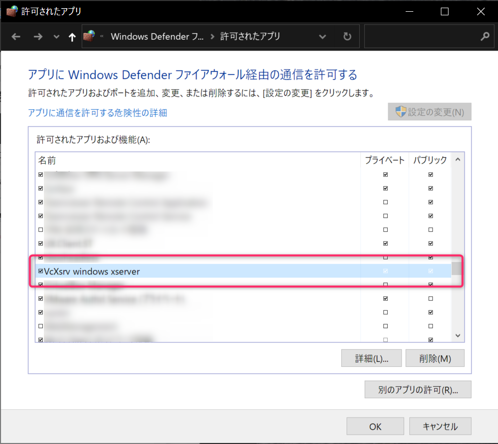

## はじめに

WSL2内のアプリをX-Server経由でWindows側にGUI表示させようとして、戸惑った点についてまとめます。

WSL2やX-Serverの設定については割愛します。

## 環境

- ホスト
    - Windows10 Professional
- WSL2
    - Ubuntu 18.04

WSL2の設定などはこちらの記事を参考してください。

[PhpStorm on WSL2でWindowsに依存しない開発環境を作る](/blog/2020/01/docker-on-wsl2-development-environment/)


## 遭遇した問題と解決方法

WSL2のX環境をセットアップして、いざGUI表示しよう！と思ったら表示されない。

下記エラーが表示されていました。

```bash
Error: Can't open display: :0.0
```

VcXsrv自体は起動しているので、```export DISPLAY=:0.0```が悪いのかと思い色々試す。

どうやら、localhostではWSL2側からホストのIPアドレスが解決できず、X環境に接続できない模様。

```export DISPLAY=192.168.0.100:0.0```のようにホストのIPアドレスを直打ちとしたら動きました。  
（192.168.0.100はホストのIPアドレス）  
IPアドレス部分は、ipconfigコマンドで表示される「イーサネット アダプター vEthernet (WSL):」となっているものでもよいらしい。

ホストのIPアドレスを直書きするのはスマートではないので色々検索。

下記Issueが上がっていました。

https://github.com/microsoft/WSL/issues/4106

下記コードを.bashrcに設定しておけばよいらしい。

```bash
export DISPLAY=$(cat /etc/resolv.conf | grep nameserver | awk '{print $2}'):0.0
```

加えてWindowsでファイアウォールを設定  
VcXsrvを許可する



設定反映のため、WSLを再起動して確認。

。。。動いた！


## 終わりに

開発環境がすべてWSL2側で完結するので、Windows側にGitやDockerなど入れなくても済むのが良いです。

また、IDEはPhpStormを使っているのですが、GitやdockerがWSL2内のものを設定できるので、環境トラブルの面倒臭さが減って良い感じ。

私はWindows10のPro版で試しているのですが、Home版でも同じように動くかは不明。
