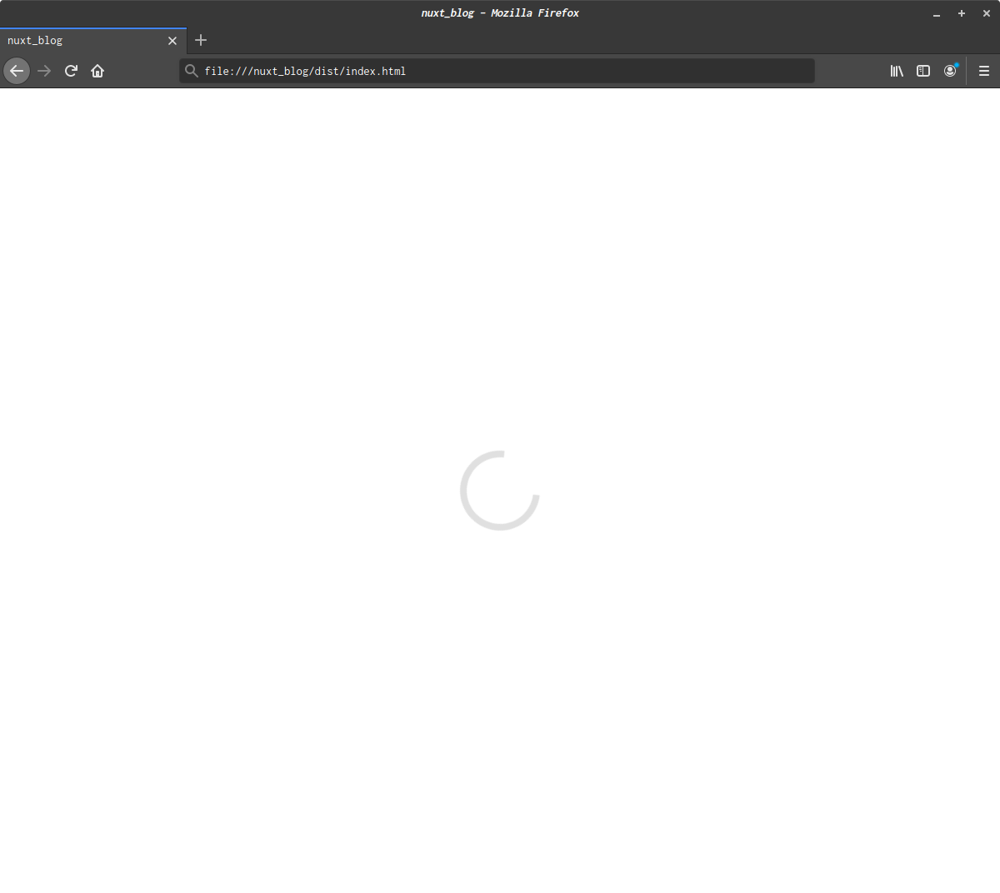

## はじめに
Nuxt.jsで静的Webサイトを作成しようと```nuxt generate```したところ、作成されたページを開いても真っ白でローディングイメージのみ表示されている状態になりました。



## 原因

いろいろググりながら試してたところ、原因は***SPAモード***に設定していたためでした。  
```nuxt generate```はSSRの機能を利用して静的ファイルを作成するようです。

```nuxt.config.js```のmodeを初期値に変更

```
module.exports = {
-  mode: 'spa',  // <- spaの設定を削除
  /*
  ** Headers of the page
  */
  head: {
  ...
```

SSRを使わないからSPAモードにしようとしたのが間違いでした。

ちなみに、プロジェクトを作る際の「server framework」はNoneでも問題ありませんでした。

```
*  Choose custom server framework (Use arrow keys)
> None (Recommended) 
  AdonisJs 
  Express 
  Fastify 
  Feathers 
  hapi 
  Koa 
  Micro 
```