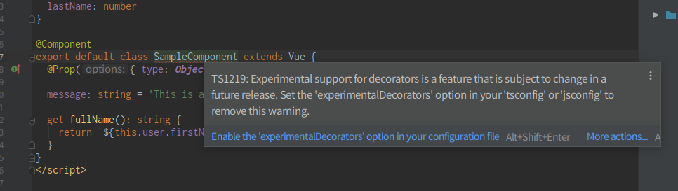

Nuxt.jsにTypescriptを適用して、Classを書こうとしたときに、下記エラーが出ました。



```bash
TS1219: Experimental support for decorators is a feature that is subject to change in a future release. Set the 'experimentalDecorators' option in your 'tsconfig' or 'jsconfig' to remove this warning.
```

エディタはIntelliJ IDEAです。

メッセージの下にも出ていましたが、configファイルで「experimentalDecorators」を有効にすると良いらしい。

ということで、tsconfig.jsonの```compilerOptions```以下に下記記述を追加するとWarningが消えます。


```bash
{
  "compilerOptions": {
    ...
+   "experimentalDecorators": true,
    ...
```
